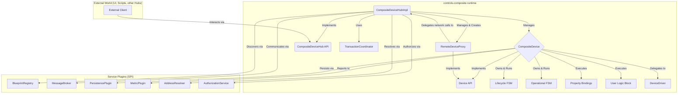
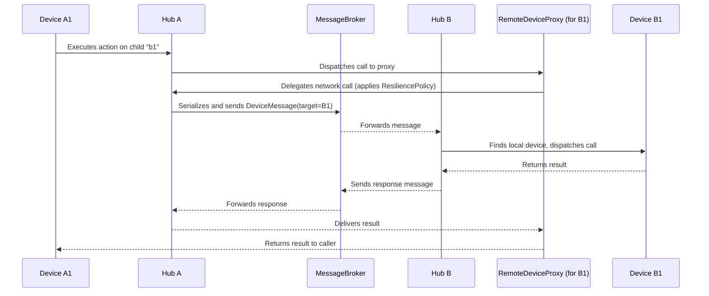

# Module controls-composite-runtime

**Maturity**: PROTOTYPE

//TODO -> Not implemented yet

## Description

This module is the core execution engine of the `controls-composite-kt` framework. It is the reference implementation that takes the declarative, stateless `DeviceBlueprint` models from `controls-composite-model` and brings them to life as stateful, interactive, and manageable `Device` instances.

The runtime is responsible for interpreting the blueprint's structure, managing the complete lifecycle via formal Finite State Machines (FSMs), executing reactive property bindings, running user-defined logic, and coordinating complex transactional plans.

## Core Philosophy & Design Principles

The runtime is architected from the ground up to support both **local (single-process) and distributed** execution models without requiring changes to the core device logic or blueprints. This is achieved through the following principles:

1.  **The Actor Model:** Each running device (`CompositeDevice`) is treated as an independent actor with its own state, behavior, and message queue (managed by its `CoroutineScope` and FSM). A `CompositeDeviceHub` acts as a local actor system, responsible for managing and routing messages to its child actors.

2.  **Location Transparency:** A device or service interacts with another device via its unique `Address`. The runtime is responsible for resolving this logical address to a physical endpoint. Whether the target device resides in the same process, on the same machine, or across the network is an implementation detail of the communication services, not a concern of the device logic itself.

3.  **Separation of Concerns (IoC):** The runtime *implements* the contracts defined in `controls-composite-model`. It does not define them. This clear separation ensures that device logic (drivers, DSL) can be written against a stable API, while the execution strategy can evolve independently.

4.  **Pluggable Services (SPI):** The runtime does not hard-code implementations for cross-cutting concerns like persistence, metrics, or network communication. Instead, it *consumes* services provided by other DataForge plugins (`PersistencePlugin`, `MetricPlugin`, `MagixBrokerPlugin`, `KtorPeerPlugin`, etc.). This makes the entire stack highly modular and configurable.

## Architectural Overview

The runtime can be visualized as a layered system where each component has a distinct responsibility. The Hub acts as the central orchestrator, managing local devices and interacting with external services and clients.

**Workflow of an `attach` operation:**

1.  An **External Client** calls `hub.attach("myDevice", blueprint, ...)` on `CompositeDeviceHubImpl`.
2.  The **Hub** uses the `AuthorizationService` to verify the client's permissions.
3.  The **Hub** uses the `BlueprintRegistry` plugin to find and validate the `blueprint`.
4.  The **Hub** instantiates a `CompositeDevice` actor for "myDevice".
5.  The `CompositeDevice` instance:
    a.  Creates its `DeviceDriver` from the blueprint.
    b.  Initializes its `Lifecycle` and `Operational` FSMs (using KStateMachine).
    c.  Recursively creates child `CompositeDevice` (for local children) or `RemoteDeviceProxy` (for remote children) actors.
    d.  Launches coroutine `Job`s to manage the reactive `bindings` between itself and its children.
    e.  Launches the `logic` block in its `CoroutineScope`.
6.  The **Hub** sends a `DeviceLifecycleEvent.Attach` to the new device's FSM, triggering its startup sequence.
7.  The device transitions through states (`Attaching` -> `Stopped`), ready for operation.

## Key Responsibilities

The `runtime` module has the following primary responsibilities:

-   **Instantiation:** To discover `DeviceBlueprint`s (via `BlueprintRegistry`) and instantiate them into live `CompositeDevice` objects.
-   **Lifecycle Management:** To create, run, and manage the KStateMachine instances for both the lifecycle and operational FSMs defined in a blueprint.
-   **Reactive Graph Execution:** To establish and execute the reactive property `bindings` between parent and child devices.
-   **Logic Execution:** To launch and supervise the user-defined `logic { ... }` blocks within the correct `CoroutineScope`.
-   **Transaction Coordination:** To provide a robust implementation of `TransactionCoordinator` that can execute complex `TransactionPlan`s, including compensating actions (Saga pattern) for rollbacks.
-   **Resilience and Security:** To act as the enforcement point for resilience policies (timeouts, retries) on remote calls and to perform authorization checks via `AuthorizationService` before dispatching any action.
-   **Service Implementation:** To provide the default, reference implementations for the core service contracts defined in `controls-composite-model`.
-   **Data Ecosystem Integration**: To expose the entire device hierarchy as an `ObservableDataTree<Meta>`, enabling seamless integration with `dataforge-data` for analysis and visualization, and to correctly implement the `Provider` model for introspection.

## Architectural Components

To achieve these goals, the `runtime` will be structured around the following key internal components, organized by package:

### 1. `runtime.execution` - The Single Device Actor

This package contains the core logic for a single, live, **local** device instance.

-   **`CompositeDevice`**: The primary stateful implementation of the `Device` and `CompositeDeviceContext` interfaces.
    -   **State:** Holds references to its `DeviceBlueprint`, instantiated `DeviceDriver`, and manages its internal state map for properties.
    -   **Lifecycle:** Owns and operates the `StateMachine` instances for its lifecycle and operational logic. Implements `LifecycleContext` to bridge the FSM definition with the live device. All FSM events are processed sequentially within the actor's scope to guarantee thread safety.
    -   **Children & Bindings:** Recursively creates child `CompositeDevice` instances and launches coroutine jobs to manage property bindings between them.
    -   **Proxying:** Forwards calls to `readProperty`, `writeProperty`, and `execute` to the appropriate methods on its `DeviceDriver`. This is the bridge between the logical device model and the physical implementation.
    -   **Integration:** Interacts with the `SnapshotStore` for persistence and the `MetricCollector` for instrumentation.
    -   **Introspection**: Provides implementations for meta-actions like `getLifecycleFsmDiagram` by leveraging KStateMachine's export capabilities.

### 2. `runtime.hub` - The Local Actor System

This package is responsible for managing a collection of devices and orchestrating high-level operations.

-   **`CompositeDeviceHubImpl`**: The reference implementation of the `CompositeDeviceHub` interface.
    -   **Device Management:** Manages the collection of top-level `CompositeDevice` instances and `RemoteDeviceProxy` instances.
    -   **Public API:** Implements the transactional `attach`, `detach`, `start`, `stop`, and `reconfigure` methods. These methods act as the main entry point for external control.
    -   **Message Routing and Security:** Dispatches commands to the correct child `CompositeDevice`. Before dispatching, it performs authorization checks using the `AuthorizationService`. For remote targets, it serializes the request and forwards it via the `MessageBroker`.
    -   **`TransactionCoordinator` Implementation:** Contains the logic to parse a `TransactionPlan` and execute its actions sequentially or in parallel, managing the compensation stack for rollback capabilities. This is a critical component for system reliability.
    -   **Data Ecosystem Integration**: Implements the data property as a live, reactive `ObservableDataTree` reflecting all properties in the hub, and fully supports the `Provider` interface for dynamic discovery.

### 3. `runtime.proxy` - Remote Device Interaction

This package formalizes interaction with devices located in other hubs.

-   **`RemoteDeviceProxy`**: A stateful client-side proxy that implements the `Device` interface for a remote `CompositeDevice`. It is created by the hub for `remoteChild` declarations or for on-demand interaction.
    -   **Resilience:** Implements the client-side logic for `ResiliencePolicy` defined in `PeerBlueprint`, wrapping remote calls in retry, timeout, and (future) circuit breaker patterns.
    -   **Delegation:** Does not contain network logic itself. It delegates the actual communication for its methods back to the parent `CompositeDeviceHub`, which centralizes message serialization and transport. This makes the proxy lightweight and focused on its resilience role.

### 4. `runtime.plugins` - Integration with the DataForge Ecosystem

This package provides the concrete implementations of service plugins that bootstrap and configure the runtime.

-   **`CompositeRuntimePlugin`**: The main entry point for the runtime. This plugin initializes and provides the `CompositeDeviceHub` instance to the context. It also registers the other essential service implementations.
-   **`PluginBlueprintRegistry`**: An implementation of `BlueprintRegistry` that discovers `DeviceBlueprint` instances provided by other loaded DataForge plugins by querying them for the `DeviceBlueprint.TYPE` target.
-   **`MetaAddressResolver`**: A simple, default implementation of `AddressResolver` that resolves `hubId`s from a static `Meta` configuration block. This is sufficient for simple distributed setups and testing.

## Execution Models: How the Design Supports Local and Distributed Systems

The core design remains the same for both models. The difference lies in which service plugin implementations are loaded into the `Context`.

### Local Execution (Default)

-   **Communication:** Direct, in-memory function calls between `CompositeDevice` instances.
-   **`AddressResolver`:** The `MetaAddressResolver` or a simple in-memory resolver is used.
-   **`MessageBroker` / `PeerConnection`:** These plugins are not loaded if no inter-hub communication is required.

### Distributed Execution

This diagram illustrates how a call from `DeviceA1` to `DeviceB1` (located in a different process) is handled:

-   **Communication:** The `CompositeDeviceHubImpl` acts as a gateway.
    -   When an action targets a device with a **local `hubId`**, the call is dispatched directly to the local `CompositeDevice` instance.
    -   When an action targets a device with a **remote `hubId`**, the call is dispatched to a `RemoteDeviceProxy`, which then uses the hub's `MessageBroker` to send a serialized `DeviceMessage`.
-   **Service Implementations:**
    -   **`MessageBroker`:** A plugin like `controls-composite-magix` is loaded to handle inter-hub messaging.
    -   **`AddressResolver`:** A more advanced implementation (e.g., based on Consul or mDNS) is used to resolve remote `hubId`s to physical `TransportAddress`es.
    -   **`PeerConnection`:** A plugin like `controls-composite-ktor` is used for efficient, out-of-band binary data transfers.

## Implementation Plan (Roadmap)

The implementation of the `runtime` will proceed in the following stages:

1.  **Stage 1: The Core Actor (`CompositeDevice`)**
    -   [ ] Implement the basic `CompositeDevice` class structure, inheriting `Device` and `CompositeDeviceContext`.
    -   [ ] Integrate `KStateMachine`. Create `StateMachine` instances for `lifecycle` and `operationalFsm` from the blueprint.
    -   [ ] Implement a concrete `LifecycleContext` to be passed to the FSM builder blocks.
    -   [ ] Implement proxying of property/action calls to the `DeviceDriver`. This includes forwarding operational FSM events linked to actions.
    -   [ ] Implement the `getState` and `getMutableState` methods for reactive property wrappers.

2.  **Stage 2: The Local Hub (`CompositeDeviceHubImpl`)**
    -   [ ] Implement `CompositeDeviceHubImpl` to manage a thread-safe collection of local `CompositeDevice` instances.
    -   [ ] Implement the `attach` logic: find blueprint, create `CompositeDevice`, register, and send `Attach` event.
    -   [ ] Implement `detach`, `start`, `stop` by dispatching the corresponding `DeviceLifecycleEvent`s to the device's FSM.
    -   [ ] Implement the Provider interface to expose the device hierarchy.

3.  **Stage 3: Essential Services**
    -   [ ] Implement `PluginBlueprintRegistry` to discover blueprints from plugins.
    -   [ ] Implement the `CompositeRuntimePlugin` to bootstrap the system.
    -   [ ] Implement the ObservableDataTree property on the Hub.

4.  **Stage 4: Reactive Graph and Logic**
    -   [ ] Implement the logic for establishing and managing property `bindings` by launching collector jobs.
    -   [ ] Implement the execution of the `logic { ... }` block within the device's `CoroutineScope`.

5.  **Stage 5: Advanced Features & Integration**
    -   [ ] Implement the `TransactionCoordinator` for executing `TransactionPlan`s.
    -   [ ] Add integration with `PersistencePlugin` (calling `snapshot`/`restore`, including FSM state serialization) and `MetricPlugin` (instrumenting properties/actions).
    -   [ ] Implement Security Enforcement: Integrate `AuthorizationService` checks into the `CompositeDeviceHubImpl` API entry points.
    -   [ ] Implement Reconfiguration API: Add the `reconfigure` method to the hub.
    -   [ ] Write comprehensive integration tests covering the full vertical slice: DSL -> Runtime -> FSM -> Bindings -> Mocked Driver.

6.  **Stage 6: Distribution**
    -   [ ] Add logic to `CompositeDeviceHubImpl` to differentiate between local and remote calls based on `Address.hubId`.
    -   [ ] Implement `RemoteDeviceProxy` and its creation within the hub.
    -   [ ] Implement message serialization and forwarding via the `MessageBroker` for remote calls.
    -   [ ] Implement Resilience Proxies: Add logic to `RemoteDeviceProxy` that applies `ResiliencePolicy` (timeouts, retries) to network calls.
    -   [ ] Write integration tests demonstrating communication between two separate `CompositeDeviceHub` instances.

### Future Work

-   **Backpressure Management:** Future versions of the runtime should consider implementing backpressure mechanisms across the `MessageBroker` to ensure system stability under high load, preventing message loss or service overload.
-   **Distributed Transactions:** The current `TransactionCoordinator` is designed for a single hub. A future distributed version would require a two-phase commit protocol or similar to ensure atomicity across multiple hubs.
-   **Circuit Breaker Pattern:** Enhance the `RemoteDeviceProxy` with a circuit breaker pattern to prevent cascading failures in a distributed system.